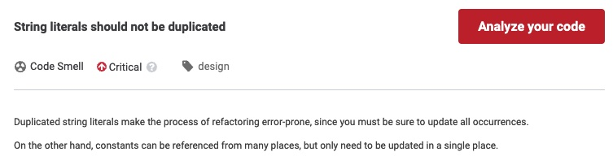
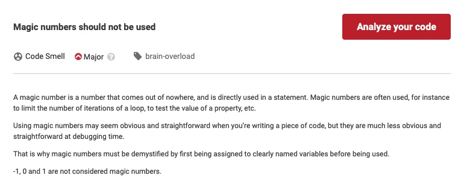

## Constants, Numeric Constants

[[Constants] https://go.dev/tour/basics/15](https://go.dev/tour/basics/15)

[[Numeric Constants] https://go.dev/tour/basics/16](https://go.dev/tour/basics/16)

Constants are usually overlooked by developers. I'm not going too far to say that you should create constants, but there are some advantages of using constants over using literals directly. But before diving on those cases, there's an obvious advantage of using constants. You can export your constants by giving them names starting with a capital letter and let the users of your library use them directly in their code just like the [math package](https://pkg.go.dev/math#pkg-constants) does. 
```go
const (
	E   = 2.71828182845904523536028747135266249775724709369995957496696763 // https://oeis.org/A001113
	Pi  = 3.14159265358979323846264338327950288419716939937510582097494459 // https://oeis.org/A000796
	Phi = 1.61803398874989484820458683436563811772030917980576286213544862 // https://oeis.org/A001622

	Sqrt2   = 1.41421356237309504880168872420969807856967187537694807317667974 // https://oeis.org/A002193
	SqrtE   = 1.64872127070012814684865078781416357165377610071014801157507931 // https://oeis.org/A019774
	SqrtPi  = 1.77245385090551602729816748334114518279754945612238712821380779 // https://oeis.org/A002161
	SqrtPhi = 1.27201964951406896425242246173749149171560804184009624861664038 // https://oeis.org/A139339

	Ln2    = 0.693147180559945309417232121458176568075500134360255254120680009 // https://oeis.org/A002162
	Log2E  = 1 / Ln2
	Ln10   = 2.30258509299404568401799145468436420760110148862877297603332790 // https://oeis.org/A002392
	Log10E = 1 / Ln10
)
```

### String Literals vs Constants

Using constants too much hurts your application's readability. Especially if they are badly named. Consider the following scenario where two totally opposite strings were named as str1 and str2 and someone reading your code should go up the see (think of this as a longer code of course) what those will print.
```go
package main

import "fmt"

func main() {
	const str1 = "The operation completed successfuly"
	const str2 = "The operation had an error"
	if 1 == 2 { // Some dummy logic, think this as a proper business logic
		fmt.Println(str2)
	} else {
		fmt.Println(str1)
	}
}
```
[Run on Go Playground](https://go.dev/play/p/yPt54LBQ7dB)

This code would be more readable if we use success and error messages as string literals like this:
```go
package main

import "fmt"

func main() {
	if 1 == 2 { // Some silly logic, think this as a proper business logic
		fmt.Println("The operation had an error")
	} else {
		fmt.Println("The operation completed successfuly")
	}
}
```
[Run on Go Playground](https://go.dev/play/p/UauwM6l3jeK)

But we can safely assume that we'll use those messages all over in our code, and this time repeating the same strings hurts maintainability. So try to find that fine balance between readablity and maintainability by declaring constants if you're using the same literal in more than one place and giving them good and meaningful names.
```go
package main

import "fmt"

const (
	successMsg = "The operation completed successfuly"
	errorMsg   = "The operation had an error"
)

func main() {
	if 1 == 2 { // Some silly logic, think this as a proper business logic
		fmt.Println(errorMsg)
	} else {
		fmt.Println(successMsg)
	}
	// Some lines below
	if 5 == 3 { // Some silly logic, think this as a proper business logic
		fmt.Println(errorMsg)
	} else {
		fmt.Println(successMsg)
	}
}
```

The well known code quality tool has a special check for repeating strings with a default value of 3. So if you repeat the same string more that 2 times, you'll be awarded(!) with this code smell:


### Magic Numbers

The term "magic number" refers to a numerical value embedded right into application logic. The magic numbers are infamous of obscuring the real intent of a business logic, therefore should be avoided. Let's consider a scenario we held a tournement and the best 16 attendees will continue to the next level, and the next 16 will be the reserves. Consider the following code piece which selects people from a sorted array and notifies them.
```go
	for i := 0; i < 16; i++ {
		notifyPerson(attendees[i], msgLevelUp)
	}
	for i := 16; i < 32; i++ {
		notifyPerson(attendees[i], msgReserve)
	}
```
What do those 16s and 32 mean to someone who supposed to maintain our code later on? Yes, they will probably try to understand by seeking those string constants and get the gist of it eventually, in the meantime swearing to the person who wrote this code in the first place. We don't want to be that person right? What if a year the commitee decides to level up 18 people instead of 16? How many magic numbers to change there? Instead we can use a numerical constant.
```go
    const numberToLevelUp int = 16
	for i := 0; i < numberToLevelUp; i++ {
		notifyPerson(attendees[i], msgLevelUp)
	}
	for i := numberToLevelUp; i < numberToLevelUp * 2; i++ {
		notifyPerson(attendees[i], msgReserve)
	}
```

In fact SonarQube also have a rule about magic numbers and again it'll consider using magic numbers as a code smell.


**The initial coding of a piece of software is the tiniest part of its lifecycle. Always code with readability and maintainability in your mind, even if you're the only one currently working on that software. Use constants when they make sense**

---

| [Previous](13.md) | [Home](../../index.md) | [Next](../flow/1-2-3-4.md) |